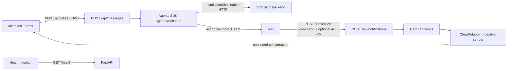

# System architecture

## Context

`app/main.py` builds FastAPI and connects its `/api/messages` route to process-wide `CloudAdapter` and `AgentApplication` instances from `app/bot/teams_bot.py`. Decorated activity handlers are registered at import time by `register_handlers()`.

## Layers

| Layer | Modules | Responsibility |
|---|---|---|
| HTTP | `main.py`, `routers/*` | Routes, header checks, transport errors |
| Bot routing | `bot/activity_handler.py` | Teams activity dispatch and event translation |
| Services | `services/*` | Notification workflow and external HTTP clients |
| Presentation | `cards/*` | Adaptive Card construction |
| Contracts | `schemas/*` | Camel-case wire validation and serialization |
| Ephemeral state | `storage/*` | Conversation references and click suppression |
| Infrastructure | `config.py`, `utils/*` | Settings, auth setup, safe logging/context extraction |

## Runtime properties

All components run in one asynchronous web process. There is no repository/database layer. `ConversationStore` and `IdempotencyStore` are in-memory singletons; their contents disappear on restart and are not shared across replicas. Proactive delivery does not currently read `ConversationStore`: n8n must supply the actual `tenantId`, `conversationId`, and `serviceUrl`.
