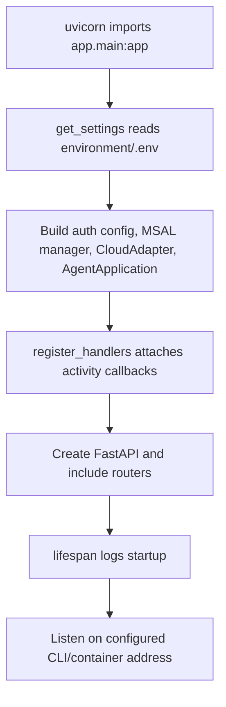

# Application and request flow

## Startup



The confirmed entry point is `uvicorn app.main:app`. `HOST` and `PORT` are settings, but application code does not pass them to Uvicorn; the CLI or container command controls binding.

## n8n notification lifecycle

```mermaid
sequenceDiagram
  participant N as n8n
  participant R as notifications router
  participant S as NotificationService
  participant C as Card builder
  participant A as CloudAdapter
  participant T as Teams
  N->>R: POST /api/notifications
  R->>R: verify optional key; parse eventType
  R->>S: handle_initial_notification/action_result
  S->>C: build card
  C-->>S: Adaptive Card JSON
  S->>A: send_to_conversation
  A->>T: continue conversation + send activity
  T-->>A: activity ID
  S-->>N: NotificationResponse
```

Validation occurs in `_parse_payload`; errors become 400. Teams send failures become 502. There is no database operation and no retry.

## Teams action lifecycle

Teams posts an authenticated invoke to `/api/messages`; the Agents SDK dispatches it to `handle_invoke`. The handler validates `riskId`/`actionKey`, suppresses a duplicate activity key for five seconds, builds `RiskActionEvent`, and calls `N8nService.send_action_event`. Teams receives an invoke response with internal status 200 or 502, while the outer Teams activity processing remains successful.

## Installation lifecycle

Add and conversation-update events capture a local reference, register the installation, and conditionally register a real channel destination. Remove events call the backend disconnect endpoint. All backend synchronization is best-effort so its failure does not fail Teams activity handling.
