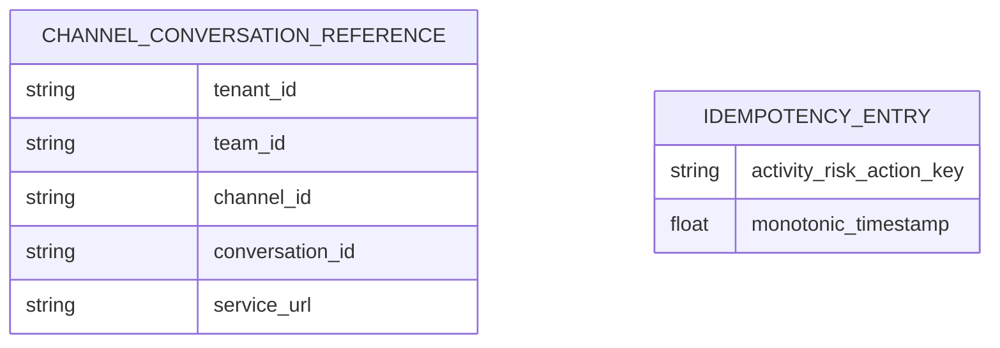

# Data and persistence design

No database connection, table, collection, model, migration, index, or repository exists in this service. Risk and installation persistence belongs to the separate StratSync backend; its schema is not confirmed from the current codebase.

## Process-memory state

### Conversation references

`app/storage/conversation_store.py` defines `ConversationStore` and `InMemoryConversationStore`. Entries are keyed by `team_id:channel_id`, written by `ConversationService.capture_from_turn_context`, readable through `get_reference`, and removable through `delete`. There are no uniqueness constraints beyond dictionary-key replacement and no timestamps. The current proactive sender does not read this store.

### Idempotency entries

`app/storage/idempotency_store.py` stores composite keys (`activity.id:riskId:actionKey`) with `time.monotonic()` timestamps. `seen_recently` both checks and records; expired entries are lazily evicted under a thread lock. The singleton window is five seconds.

Both stores are lost on restart and diverge across workers/replicas.
