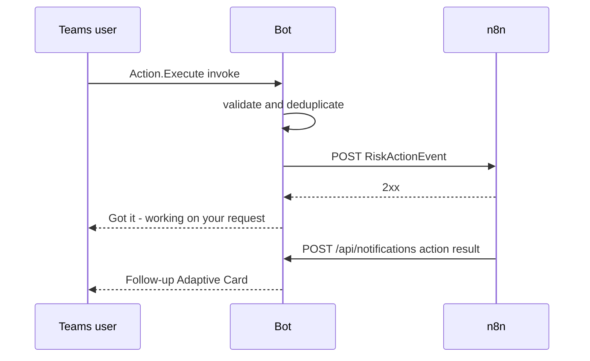

# External integrations

## Microsoft Teams

Related code: `app/bot/*`, `app/config.py`, `app/cards/*`. Teams calls `/api/messages` with activities. The SDK validates JWTs and routes activities. Proactive calls reconstruct `ConversationReference` from the destination supplied by n8n, continue that conversation, and send an Adaptive Card attachment. Credentials are Microsoft app ID, client secret, and tenant ID. Failures during proactive sending become HTTP 502 to n8n; lifecycle failures are best-effort.

## n8n

n8n calls `/api/notifications` with initial or action-result commands. A Teams card click flows back to `N8N_ACTION_WEBHOOK_URL`:

The action webhook has a configurable timeout, no retry, and ignores successful response bodies.

## StratSync backend

Lifecycle events call three endpoints below `BACKEND_BASE_URL`: installation registration, destination registration, and disconnect. The bot sends Microsoft tenant/team/conversation metadata but never an `accountId`; the backend is expected to resolve tenant ownership. Backend implementation and persistence are outside this repository.

## Network trust

There are no allowlists or URL validation in application code. `N8N_ACTION_WEBHOOK_URL` and `BACKEND_BASE_URL` are operator-controlled; notification `serviceUrl` is caller-controlled and reaches SDK continuation behavior. TLS, reverse proxy behavior, and firewall rules are not confirmed from the current codebase.
