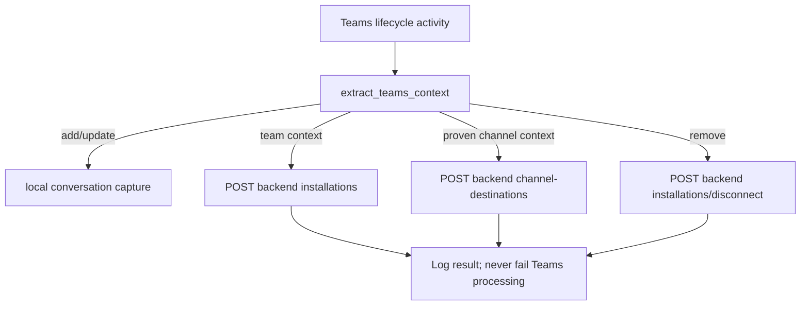

# Webhooks and events

## Inbound HTTP events

| Source | Event | Entry point | Outcome |
|---|---|---|---|
| Teams | `installationUpdate/add` | `/api/messages` → `handle_installation_update` | Capture reference; register installation/destination |
| Teams | `installationUpdate/remove` | same | Backend soft-disconnect |
| Teams | `conversationUpdate` | `handle_conversation_update` | Same registration path |
| Teams | `message`: `connect` / `disconnect` | registered `on_message` | Explicitly register or disconnect the exact channel |
| Teams | `invoke` / `adaptiveCard/action` | `handle_invoke` | Forward action to n8n and synchronously acknowledge |
| n8n | `initial_notification` | `/api/notifications` | Render and proactively send initial card |
| n8n | `risk_action_result` | same | Render and send follow-up card |

## Outbound action event

```json
{
  "eventId":"generated-uuid","riskId":"RSK-1","actionKey":"view_details",
  "destination":{"tenantId":"tenant","teamId":"team","channelId":null,"conversationId":"conversation","serviceUrl":"https://smba.trafficmanager.net/apac/"},
  "actor":{"id":"teams-user","name":"Example User","aadObjectId":"aad-id"},
  "payload":{}
}
```

Button data beyond `riskId` and `actionKey` is copied into `payload`. Duplicate suppression uses the Teams activity ID plus those two values for five seconds.

## Lifecycle event flow



There is no queue, scheduled event, background worker, webhook signature specific to n8n, or replay/dead-letter mechanism.
