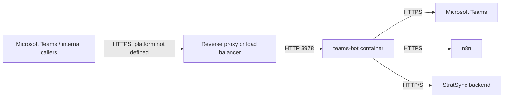

# Deployment and infrastructure

The only deployment artifact is `Dockerfile`. It builds from `python:3.12-slim`, installs pinned requirements and `curl`, copies `app/`, creates non-root UID 1000, exposes 3978, and runs one Uvicorn process on `0.0.0.0:3978`.

The edge component is required for a normal public Teams deployment but is not present or confirmed in this repository.

| Service | Port | Exposure | Purpose |
|---|---:|---|---|
| Uvicorn container | 3978 | Container port; public status depends on platform | HTTP API |
| Backend default | 8000 | External to this container | Local backend default |

No health instruction exists in Docker, although `/health` is available. No Docker Compose, Kubernetes, nginx, TLS, cloud service manifest, deployment script, or CI/CD workflow is present. Image registry, replica count, autoscaling, secret store, DNS, certificate, and rollback procedure are not confirmed from the current codebase.

Multiple replicas are unsafe for reliable in-memory deduplication/reference storage; outbound notification delivery itself uses caller-supplied context and can run on any replica.
